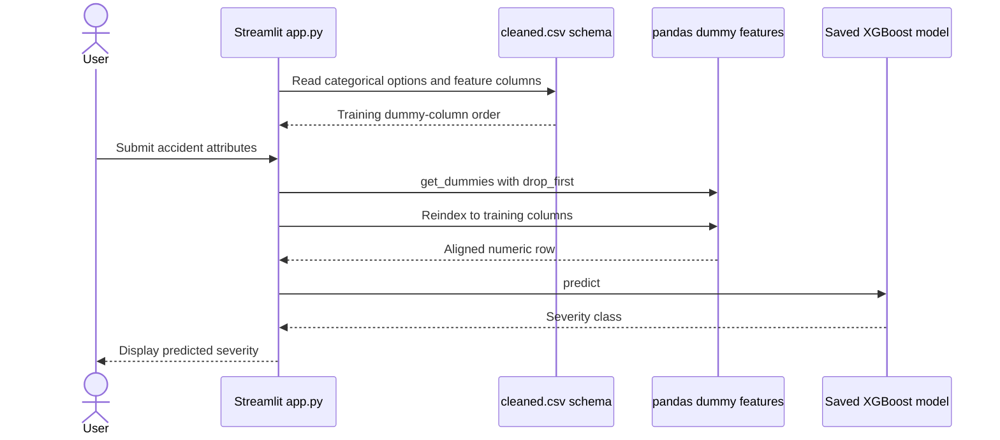

# Traffic Accident Prediction

A Streamlit accident severity demo that reconstructs its one-hot feature schema from a committed reference dataset and runs a saved XGBoost classifier.

**Technology:** Python · XGBoost · pandas · Streamlit

## Features

- Collect 14 driver, vehicle, collision, road, and environment inputs.
- Derive expected dummy columns from `cleaned.csv` using `get_dummies(drop_first=True)`.
- Align encoded user inputs with that schema before classification.

## Repository guide

| Path | Purpose |
|---|---|
| [app.py](app.py) | Form, one-hot encoding, and prediction. |
| [cleaned.csv](cleaned.csv) | Reference data used to build category options and feature columns. |
| [xgboost_model.json](xgboost_model.json) | Model loaded by the application. |
| [requirements.txt](requirements.txt) | Runtime dependencies. |

## Requirements and current limitations

Both `cleaned.csv` and `xgboost_model.json` are needed at startup. Changing category values or the reference CSV can change the encoded schema and invalidate compatibility with the trained model. Additional pickle exports are committed, but the current app loads the JSON model.

## UML diagrams

### Main workflow

The application reconstructs its dummy-column schema from cleaned.csv, then aligns each submitted row to that schema before prediction.



## Getting started

```bash
git clone https://github.com/IbrahimAbdelsattar/Traffic_Accident_Prediction.git
cd Traffic_Accident_Prediction
```

Use a Python virtual environment:

```bash
python -m venv .venv
```

Activate it with `source .venv/bin/activate` on macOS/Linux or `.venv\Scripts\Activate.ps1` in PowerShell.

```bash
python -m pip install -r requirements.txt
python -m streamlit run app.py
```
